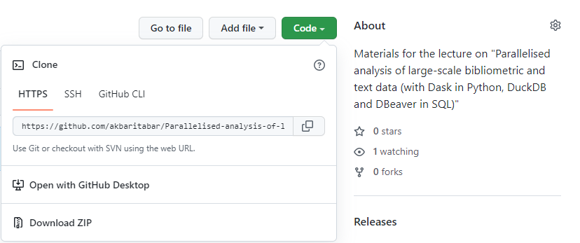

# Materials for the lecture on "Parallelised analysis of large-scale bibliometric and text data (with Dask in Python, DuckDB and DBeaver in SQL)"

Speaker:

- **Aliakbar Akbaritabar**, research scientist at the Max Planck Institute for Demographic Research (MPIDR), GitHub: [https://github.com/akbaritabar](https://github.com/akbaritabar), (akbaritabar@demogr.mpg.de)

## Instructions for participants

0. Please clone or download this repository ([https://github.com/akbaritabar/Parallelised-analysis-of-large-scale-bibliometric-and-text-data](https://github.com/akbaritabar/Parallelised-analysis-of-large-scale-bibliometric-and-text-data.git)) by clicking on the green button on top right (see photo)

1. Please go over the presentation files in the `2_presentations` directory, some are *self-study* materials that in combination with Python and R scripts in `0_code` directory should help you set-up and get started. You can ask your clarification questions by email or during the Q&A sessions.
2. For `Python` users to replicate the results, you should follow steps outlined in `0_code\01_Required_installation_setup_python.md` to have all necessary libraries installed.
3. For `R` users to replicate the results, you should follow steps outlined in `0_code\02_Required_installation_setup_R.md` to have all necessary libraries installed.
